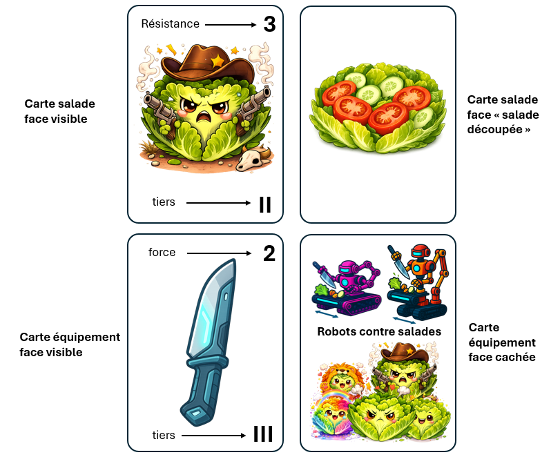
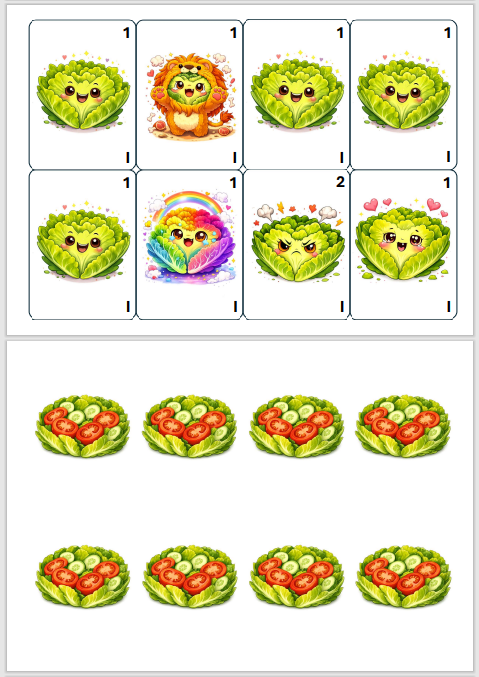
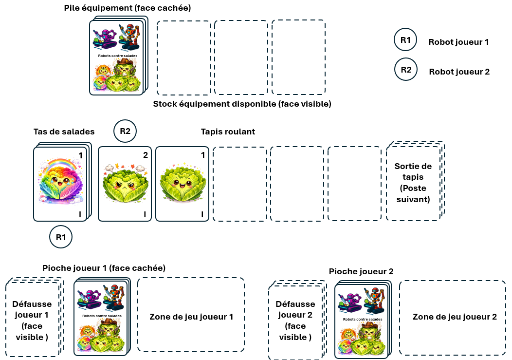
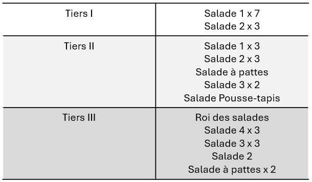

# 🤖🥗 ROBOTS CONTRE SALADES  
**Jeu de cartes coopératif imprimable pour 2 joueurs de 6 ans et +**

- Auteurs : Tilo Kerfriden Claus et Pierre Kerfriden
- Licence : Creative Commons Attribution–NonCommercial (CC BY-NC)

---

## LA RÉVOLTES DES SALADES

Bienvenue dans l’usine GreenBot Industries, leader mondial de la salade composée automatisée 🏭🥗.

Chaque jour, des milliers de salades fraîches arrivent sur une chaîne de production ultramoderne : lavage, découpe, assemblage… tout est réglé comme une horloge.

Tout… jusqu’à aujourd’hui.

Depuis peu, les salades s’arment, résistent à la découpe, et certaines tentent même d’accélérer la chaîne de production pour atteindre la sortie sans être découpées.

À leur tête :
👑 le Roi des Salades, instigateur de la rébellion verte.

Vous incarnez deux robots de découpe envoyés en urgence pour reprendre le contrôle de la production.

Votre mission : coopérer, améliorer vos équipements grâce aux mises à niveau que vous revevrez lors de vos exploits, et empêcher les salades rebelles de mettre le chaos dans le système de production.

---

## OBJECTIF DU JEU

Les joueurs gagnent la partie lorsque :

> **toutes les cartes Salade ont atteint la sortie du tapis roulant de découpe (7ᵉ emplacement)**,  
> **sans qu’aucune condition de défaite ne se soit produite**.

---

## CONDITIONS DE DÉFAITE

La partie est immédiatement perdue si :

- **3 salades non découpées** sont passées par la **sortie de tapis** ;
- le **Roi des Salades** passe par la sortie de tapis **sans avoir été découpé**.

---

## MATÉRIEL

### 🥬 Cartes Salade (30)

- 10 cartes Tier I  
- 10 cartes Tier II  
- 10 cartes Tier III  

Toutes les cartes Salade commencent **face non découpée visible**.  
Chaque carte indique uniquement sa **résistance**.

---

### ⚙️ Cartes Équipement (30)

Chaque carte possède **deux faces** :
- une **face cachée**,
- une **face équipement** indiquant :
  - le **tier**,
  - le **type d’équipement**,
  - une **valeur numérique** *(optionnelle — certaines cartes, comme le Lapin, n’en ont pas)*.

---

### Autres éléments

- 2 pions **Robot** (non fournis, prendre des briques LEGO par exemple)
- 1 deck personnel de départ de **8 cartes** pour chacun des deux joueurs

---

### IMPRESSION DES CARTES

Les cartes à imprimer sur du papier A4 (8 carte par page) sont disponibles en cliquant sur l'image ci-dessous.

Il est possible d'imprimer les planches en recto-verso directement (bordure sur le côté court), mais les cartes ainsi obtenues sont difficiles à manipuler car elles sont trop fines. Nous recommendons d'imprimer en recto, et de coller chaque paire de feuille imprimer de part et d'autre d'une feuille blanche plus rigide, avant de procéder au découpage de l'assemblage ainsi obtenu. 

Les cartes peuvent être glissées dans des protèges-carte standard de manière à faciliter les opérations de mélange des cartes. Les cartes imprimées et découpées ont un format standard d'environ 63 × 88 mm, ce qui permet d'utiliser des protège-carte du commerce.

---

## MISE EN PLACE

### 1) Préparer le deck Salades

1. Mélangez séparément les cartes Salade de chaque tier.
2. Formez un deck unique en empilant :
   - **Tier III** en bas
   - **Tier II** au milieu
   - **Tier I** au-dessus
3. Placez le deck **face salade non découpée visible**.

👉 Le dessus du deck correspond au **premier emplacement du tapis**.

---

### 2) Avancée initiale du tapis

Le tapis est matérialisé par le **déroulement des cartes Salade**.

1. Prenez la carte du dessus du deck Salade et placez-la à côté du deck.  
2. Décalez cette carte d’un emplacement.
3. Prenez une nouvelle carte du dessus du deck Salade et placez-la dans l’emplacement libéré.

👉 À l’issue de cette mise en place :
- **3 cartes Salade** sont visibles sur le tapis,
- cette avancée **remplace la phase Salades du premier tour**.

---

### 3) Le tapis et la sortie de tapis (7ᵉ emplacement)

- Le tapis forme **une ligne de cartes Salade** depuis le deck.
- Entre le deck Salade et la sortie de tapis, il y a **exactement 5 emplacements**.
- Avec les deux extrémités, cela fait **7 emplacements** au total.

La **sortie du tapis de découpe** correspond au **7ᵉ emplacement** :
- elle n’est pas matérialisée au début de la partie,
- toutes les salades qui y arrivent sont **empilées** (découpées ou non),
- les robots ne peuvent plus **interagir** avec ces salades.

---

### 4) Préparer le deck Équipements

1. Mélangez séparément les cartes Équipement de chaque tier.
2. Formez un deck unique en empilant :
   - **Tier III** en bas
   - **Tier II** au milieu
   - **Tier I** au-dessus
3. Placez le deck Équipement **face cachée**.

👉 L’emplacement suggéré est montré sur le **schéma de mise en place**.  
👉 Aucune carte Équipement n’est visible au début de la partie.

---

### 5) Préparer les joueurs

Chaque joueur :

1. Prend son deck de départ de 8 cartes :
   - 4 🔪 Couteaux de cuisine basiques de valeur 1
   - 4 🛼 Rollers basiques permettant un déplacement de 1 emplacement le long du tapis
2. Mélange son deck.
3. Place son robot **adjacent à une salade visible** sur le tapis de découpe.

Le deck Salade fait partie du tapis : un robot peut s’y placer adjacent.  
En revanche, il ne pourra jamais être adjacent à l’emplacement matérialisant la **sortie du tapis** de découpe. Il ne pourra pas non plus être adjacent à un emplacement non matérialisé (l'ensemble des 6 emplacements du tapis n'est pas matérialisé en début de partie).

---

## DÉROULEMENT D’UN TOUR

Chaque tour se déroule dans l’ordre suivant.

---

### 1️⃣ Phase Salades – Avancée du tapis

> Cette phase n’est pas effectuée lors du premier tour (elle fait partie de la mise en place du jeu).

À partir du deuxième tour :

- Révélez **2 cartes Salade** depuis le deck.
- Chaque nouvelle carte pousse les autres d’un emplacement vers la sortie de tapis.
- Si une salade atteint le **7ᵉ emplacement**, elle est empilée à l'emplacement de sortie de tapis.

#### Salade *Pousse-Tapis*
Lorsqu’une salade *Pousse-Tapis* apparaît :

- le nombre de cartes révélées à chaque phase Salades augmente de **+1** (ex : 2 → 3),
- l’effet est **permanent** et correspond à une accélération du jeu.

---

### 2️⃣ Phase Joueur

Les joueurs choisissent librement qui est le joueur actif.

Au début de son tour, le joueur actif pioche jusqu’à avoir **3 cartes en main**.

Si son deck est vide, il mélange **sa défausse** puis pioche le nombre de cartes manquantes. S’il n’y a plus assez de cartes, il pioche autant que possible.

---

### Jouer des cartes

- Les cartes jouées sont posées dans la **zone de jeu** du joueur actif.
- Elles vont dans **sa défausse** à la fin du tour.

---

## CARTES ÉQUIPEMENT – EFFETS

### 🔪 Couteau
- Tente de découper une salade **adjacente** au robot.
- Si **valeur du couteau ≥ résistance de la salade** → la salade est **découpée** avec succés.

**Coopération**  
Si l’autre robot est aussi adjacent à cette salade, l'opération de découpe bénéficie d'un bonus de +1 pour cette action. **Bien coordonner les deux robots est fondamental** pour remporter la victoire, car les salades sont souvent trop résistantes par rapport au niveau des outils de découpe fournis par le jeu.

---

### 🛼 Rollers
- Déplace le robot du nombre d’emplacements indiqué.
- Le robot ne peut pas se déplacer vers un emplacement qui n'est **pas encore matérialisé** (par exemple au début de la partie quand le tapis fait moins de 6 emplacement de long).

---

### 💣 Boule de Check
- Permet de tenter de découper jusqu’à **3 salades** : la salade immédiatement adjacente en robot actif et les deux salades adjacentes à cette-dernière.
- Chaque salade est découpée  si **résistance ≤ valeure** de la Boule de Check.

---

### 🧹 Tapis de Check
- Fait reculer toutes les salades **non découpées** au plus près du deck Salade,
- en conservant leur ordre,
- et en faisant passer les salades découpées et les emplacements vides (créés lorsqu'un Super Lapin mange une salade) devant, c'est-à-dire vers la sortie du tapis.

---

### 🧠 CPU
- Pioche un nombre de cartes égal à la valeur indiquée.

Si le deck est insuffisant :
- mélangez la défausse pour compléter,
- si aucune carte n’est disponible : la pioche s’arrête.

La carte CPU utilisée reste dans la **zone de jeu** pendant cet effet.

---

### 🐰 Super Lapin
- Mange n’importe quelle salade sur le tapis.
- La salade visée ne doit pas forcément être adjacente au robot actif
- La salade est retirée du jeu.
- L’emplacement devient vide, matérialisé par une **carte blanche**.
- Aucun équipement n’est gagné.

---

## DÉCOUPE ET ÉQUIPEMENTS

### Récompenses
Lorsqu’une salade est découpée (couteau ou Boule de Check) :
1. Révélez la carte du dessus du deck Équipement.
2. Ajoutez-la au stock d’équipements visibles.

Le Stock limité à **3 cartes** : si une 4ᵉ carte équipement arrive dans le stock, il faut retirer la plus ancienne du jeu.

### Cas particuliers
- Super Lapin : ne donne droit à aucun équipement.
- Roi des Salades : lorsqu’il est découpé, ajoutez immédiatement un **Rollers de 7 lieues** au stock, sans piocher.

---

## MISE À NIVEAU DES ROBOTS

À n’importe quel moment de son tour, le joueur actif peut :

1. Retirer du jeu **une carte non jouée** de sa main.
2. Prendre **une carte du stock d’équipements visibles**.
3. Cette carte est considérée comme **jouée sans effet** (elle ira dans sa défausse à la fin de son tour).
4. Elle sera utilisable **la prochaine fois** qu’elle sera piochée depuis le deck.

Cette action peut être répétée autant de fois que souhaité.

👉 Le deck personnel contient toujours **8 cartes**.

---

## LA DÉFAUSSE

- À la fin du tour du joueur actif, toutes les cartes jouées sont placées dans **sa défausse**, face visible.
- Il est autorisé de consulter sa défausse à tout moment.
- Il est interdit de consulter son deck face cachée.

---

## SALADES SPÉCIALES

### 👑 Roi des Salades
- Si le Roi atteint la sortie de tapis non découpé : défaite immédiate.

### ⚙️ Salade Pousse-Tapis
- Voir règle dans la Phase Salades (augmentation permanente de la vitesse).

### 🦵 Salade à pattes
- Se rue devant la salade non découpée la plus proche de la sortie du tapis de découpe,
- en poussant vers l’avant les salades découpées situées entre la salade non découpée la plus proche de la sortie de tapis et l'emplacement de sortie de tapis.

---

## SORTIE DE TAPIS – INTERDICTIONS

Les robots ne peuvent pas interagir avec les salades déjà empilées à l'emplacement de sortie du tapis de découpe.

Il est interdit d’utiliser sur elles :
- une Boule de Check,
- un Lapin,
- un Tapis de Check,
- ou tout autre effet.

Il est aussi interdit de placer un robot de manière adjacente à le sortie de tapis.

---

## FIN DE PARTIE

### Victoire si
Toutes les cartes Salade ont atteint la sortie de tapis sans qu’aucune condition de défaite ne se soit produite.

### Défaite si
- 3 salades non découpées ont atteint la sortie de tapis  
- ou le Roi des Salades y arrive non découpé

---

## NIVEAUX DE DIFFICULTÉ

Les niveaux modifient principalement la composition du deck Équipement, et quelques règles mineures.

### Règles spécifique au niveau facile
- le roi des salades ne provoque pas la défaite immédiate
- les salades à pattes sont des salades standards

### Niveau avancé – introduction du disque dur
Effet : **piocher 1 carte, puis dupliquer une carte de la main**.

---

## LISTE DES CARTES SALADE

## LISTE DES CARTES EQUIPEMENT PAR NIVEAU DE DIFFICULTÉ

---

## VARIANTE – DOUBLE ACCÉLÉRATION (non testée)

Cette variante est indépendante des niveaux de difficulté.

- Ajoutez une carte **Salade Pousse-Tapis** dans le **Tier I** des Salades  
  *(retirez une salade normale de réistance = 1 du Tier I)*.
- Une autre Salade Pousse-Tapis est déjà présente dans le **Tier II**.

Résultat : il y aura **deux accélérations** dans la partie.

